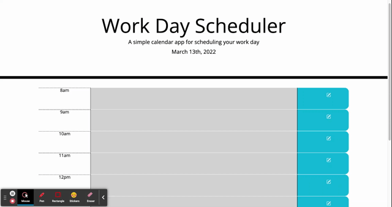

## Description
Users with busy schedules can keep their hourly tasks tracked with this Word Day Scheduler. It has time blocks for a 8am-5pm work day schedule, with color coding for easy reference. 

## Table of Contents
1. [Usage](#usage)
2. [Updates](#updates)
3. [Liscense](#liscense)

## Usage 
Users for this scheduler can click on the time block they want to schedule something for, type in their event, and click the save button for that time slot in order to save the task. Upon reload, users will find that their tasks have been saved and will not clear from their schedule. Users can also reference their schedule easily with the color coding system: grey for past hours, red for the current hour, and green for future hours. 

link: [Word Day Schedule](https://allygarcia152.github.io/work-day-scheduler/)

## Updates
The word day scheduler came with html with a hero/jumbotron and css styling for html that were not yet created. This latest update included the hard coded hour blocks for 9am - 5pm as well as JS and jQuery for dynamic interaction for each hour block.

## Liscense
:) 
